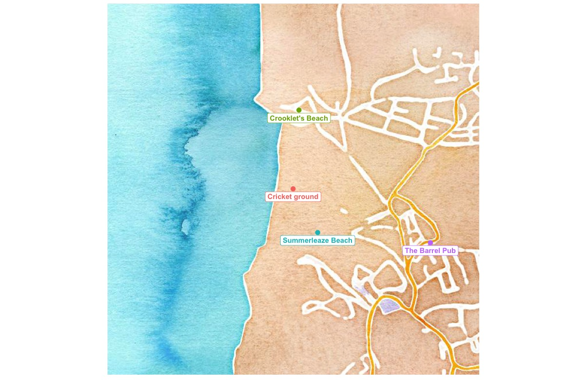
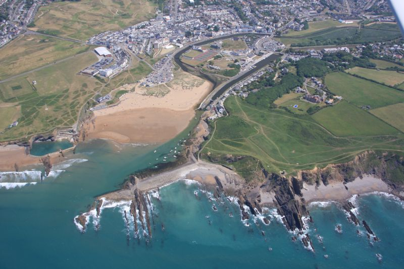
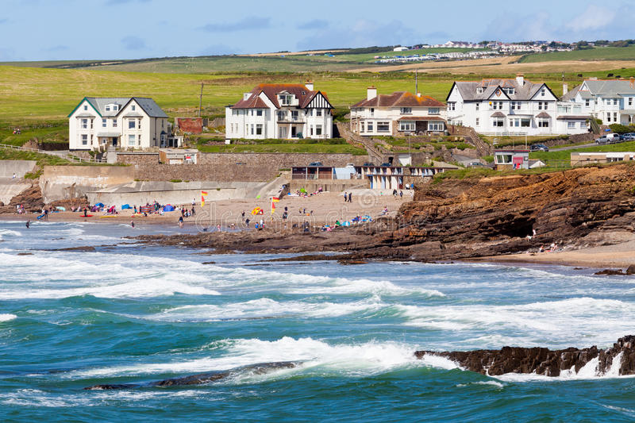
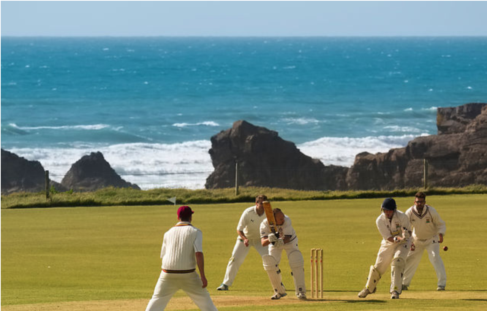
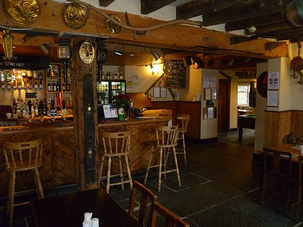
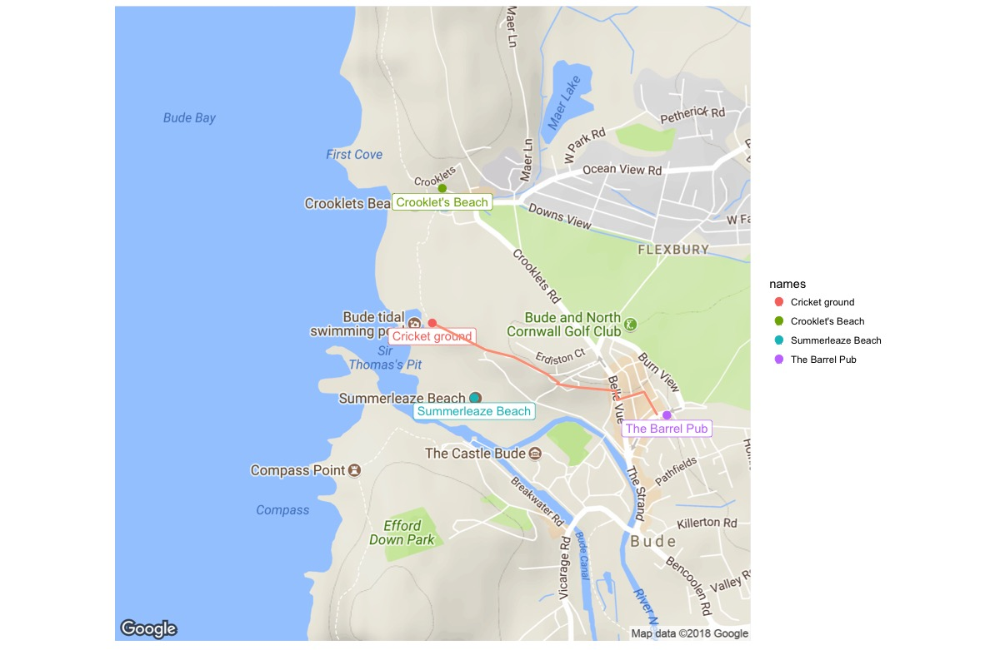

```{r setup library, include = FALSE, results="hide"}
library(ggmap)
library(tidyverse)
library(knitr)
library(ggplot2)
```
```{r setup, include = FALSE, results = "hide"}
# choose the center of map to be Summerleaze Beach
#center <- geocode("Summerleaze Beach, Summerleaze Cres, Bude EX23 8HN, UK")
center <- geocode("S W Coast Path, Bude EX23 8HN, England")
# map
m <- get_map(center, zoom = 15)
# water map
m_w <- get_map(center, maptype = "watercolor", zoom = 15)

beach1 <- geocode("Crooklets Beach, Bude, England")
beach2 <- geocode("Summerleaze Beach, Bude, England")
# North Cornwall Cricket ground
crickground <- geocode("S W Coast Path, Bude EX23 8HN, England")
# the barrel
pub <-  geocode("36 Lansdown Rd, Bude EX23 8BN, UK")

d <- rbind(beach1,beach2,crickground,pub)
d
names <- c("Crooklet's Beach","Summerleaze Beach","Cricket ground","The Barrel Pub")
d <- cbind(d,names)
d
source <- "S W Coast Path, Bude EX23 8HN, UK"
dest <- "36 Lansdown Rd, Bude EX23 8BN, UK"
rou <- route(source, dest,mode="walking", structure = "route")
```

# The Town of Bude in Water Color
Bude is a small seaside resort town in north Cornwall, England, UK, in the civil parish of Bude-Stratton and at the mouth of the River Neet (also known locally as the River Strat).
```{r waterColor Map,echo=FALSE,include = FALSE, result = "hide", fig.height=8,fig.width=8}
ggmap(m_w) +
  geom_label(
    aes(x = lon, y = lat, label = names, col=names),
             fontface = "bold" ,data = d,
             vjust = 1.3, hjust = (0.5)
    ) +
  geom_point(
    aes(x = lon, y = lat, col = names),
    data = d, size = 3 ) +
  theme(axis.line=element_blank(),axis.text.x=element_blank(),
        axis.text.y=element_blank(),axis.ticks=element_blank(),
        axis.title.x=element_blank(),
        axis.title.y=element_blank(),legend.position="none")
```
```{r echo=FALSE,out.width = "100%"}

```

\newpage
# Summerleaze Beach
Located within easy walking distance of Bude town centre Summerleaze is a popular beach. It also has a large breakwater complete with tower protecting a small harbour and the mouth of the Bude canal with its massive lock gates. On the opposite side of the beach there's a sea-water bathing pool making for safe bathing whatever the conditions. Backing onto the beach are grassy downs and the River Neet.

[Moreinfo.](https://www.cornwall-beaches.co.uk/north-cornwall/summerleaze.htm)
```{r echo=FALSE,fig.height=6,fig.width=6, fig.align = "center", out.width = "60%"}

```

# Crooklets Beach
The small beach of Crooklets ajoins Summerleaze and Northcott Mouth at low tide forming a larger bay. The sandy beach is bordered to the north by Wrangle point and seperated from Summerleaze beach to the south by a rocky outcrop.
A popular family beach with plenty of facilities, Crooklets can get a little busy during the summer months. The beach received a Blue Flag Award in 2007

[Moreinfo.](https://www.cornwall-beaches.co.uk/north-cornwall/crooklets.htm)

```{r echo=FALSE, fig.height=6,fig.width=6, fig.align = "center", out.width = "60%"}

```
\newpage
# Cricket Ground -- Bude North Cornwall Cricket Club
Bude North Cornwall Cricket Club is situated on the clifftops overlooking the Atlantic Ocean, and is quite simply one of the most stunning locations you could ever wish to visit, let alone play cricket at! 
[MoreInfo.](http://budecc.play-cricket.com/)

```{r echo=FALSE, fig.height=6,fig.width=6, fig.align = "center", out.width = "60%"}

```

# LOCAL PUB -- The Barrel at Bude:
The Barrel at Bude is the second micropub to open in Cornwall and is the first in the north of the county. Its premises is in one of the oldest cottages and at the very heart in this popular North Cornwall seaside town. They only sell craft ales which they directly source from small independent Cornish brewers as well as two craft ales on tap including popular and well sought after craft brewers such as Verdant, Black Flag, Harbour and Firebrand. Snacks are also Cornish with Cornish Pasty crisps and Cornish Charcuterie salami; pig sticks! Opening hours are Thursday 4pm – 9pm, Friday, 4pm – 10pm, Saturday, 1pm – 9pm and Sunday 1pm-4pm.

[MoreInfo.](http://www.micropubassociation.co.uk/micropubs/the-barrel-at-bude/)
```{r echo=FALSE, fig.height=6,fig.width=6, fig.align = "center", out.width = "60%"}

```


# Find Your Way There! After Playing some Cricket.
```{r routeMap,echo=FALSE,include = FALSE, result = "hide", fig.height=8,fig.width=8}
ggmap(m) +
    geom_label(
    aes(x = lon, y = lat, label = names, col=names),
             fontface = "plain" ,data = d,
             vjust = 1.3, hjust = (0.5)
    ) +
  geom_path(
    aes(x = lon, y = lat), colour = "#ff9f84", size = 1,
    data = rou, lineend = "round"
  ) +
  geom_point(
    aes(x = lon, y = lat, col = names),
    data = d,size = 3) +
  #geom_text(x=-4.550, y=50.8337, angle = 45, colour = "#ff9f84",size = 4)+
  theme(axis.line=element_blank(),axis.text.x=element_blank(),
        axis.text.y=element_blank(),axis.ticks=element_blank(),
        axis.title.x=element_blank(),
        axis.title.y=element_blank())
```
```{r echo=FALSE, out.width = "100%"}

```

